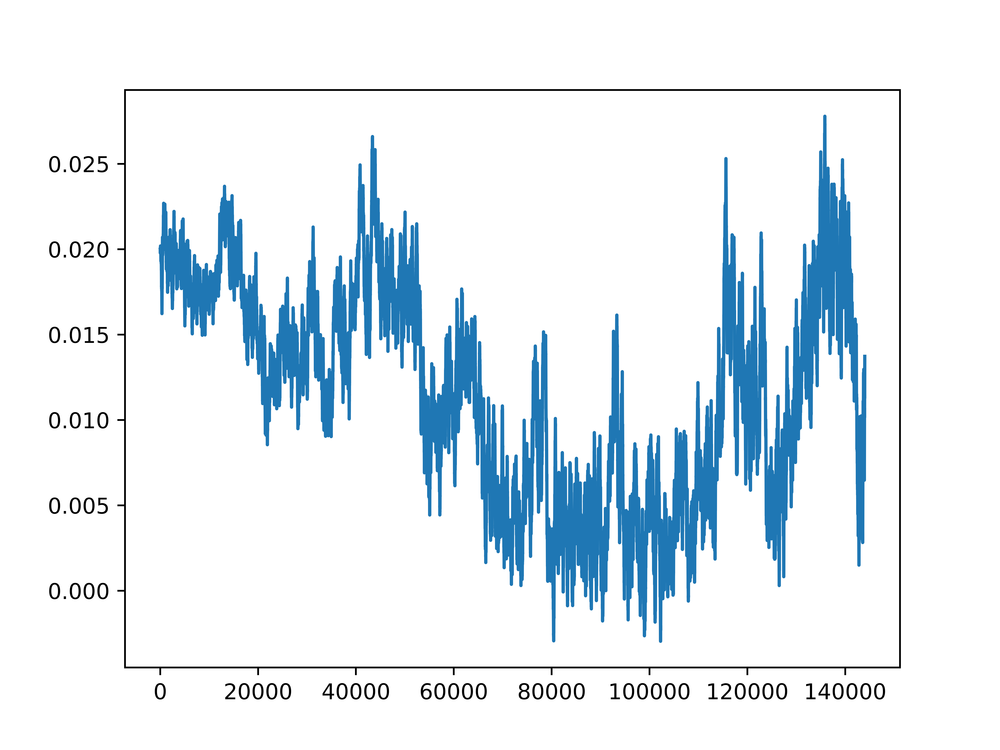

This tool is able to simulate stocks using sine and cosine functions. Parameters that can be set are: min price, max price, current price, simulation time, volatility, value scaler. The simulation time is given in days and for every minute a data point per stock is generated. By changing the value scalar the general value of a stock can be set. The saved current price is calculated by dividing the simulated price by the value scalar. Volatility of the stock is modeled by the difference in minimum and maximum price. A larger volatility will allow for a bigger difference in minimum and maximum value. For example, to generate a penny stock set volatility to 0.9 and value scaler to 100. The global market mode will add an overlaying market sentiment that will influence all stocks.

The ptyhon script accepts a json file as argument, else it will ask for parameters. If save is true then an json file will be saved.

arguments when using a json input: simple-stock_market.py json.txt simulation_time(int) save(0,1) save_fig(0,1), save_mode(0,1) global_market(0,1) global_market_strength(int)

  

  

* * * * *

Version: 0.1

This project is licensed under the terms of the Creative Commons
Attribution-ShareAlike 4.0 International Public License license

Copyright 2021, Laurens Edwards, All rights reserved.

\*\*\*\*\*\*\*\*\*\*\*\*\*\*\*\*\*\*\*\*\*\*\*\*\*\*\*\*\*\*\*\*\*\*\*\*\*\*\*\*\*\*\*\*\*\*\*\*\*\*\*\*\*\*\*\*\*\*\*\*\*\*\*\*\*\*\*\*\*\*\*\*\*\*\*\*\*\*\*\*\*\*\*\*\*\*\*\*\*\*\*\*\*\*\*\*\*\*\*\*\*\*\*\*\*\*\*\*\*\*\*\*\*\*\*\*\*\*\*\*\*\*\*\*
